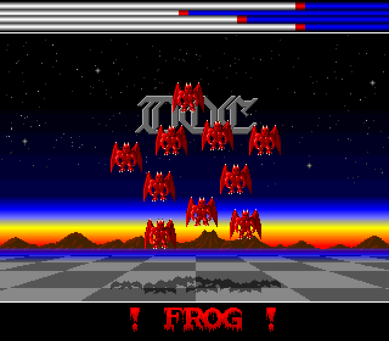

# D.O.C. - "DEMONS ARE FOREVER"
## An Amiga Demo Disassembly

This is a disassembled and slightly modernized version
of the demo *Demons Are Forever* for Commodore Amiga
computers by the scene group
[D.O.C.](https://demozoo.org/groups/650/), released in
1988, written in Motorola 68000 assembler.

- Coding: Unknown
- Music: Frog
- Graphics: Esteban, Future Light, Zoci Joe
- Scroll text: Dr. Mabuse

The disassembly was done using ReSource V6.06 on an emulated
Amiga. The graphics were extracted from the executable file
using [Maptapper](https://codetapper.com/amiga/maptapper/).
Further editing and testing was done using
[Visual Studio Code](https://code.visualstudio.com/) with the
[Amiga Assembly](https://github.com/prb28/vscode-amiga-assembly)
extension.

## References

* [Demozoo](https://demozoo.org/productions/29067/)
* [Pouet](https://www.pouet.net/prod.php?which=7066)
* [Kestra BitWorld](http://janeway.exotica.org.uk/release.php?id=269)

## Author
MnemoTroN / Spreadpoint, Feb 2025
